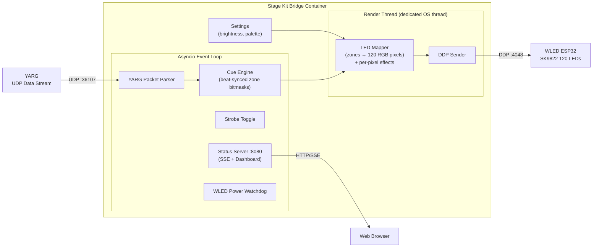
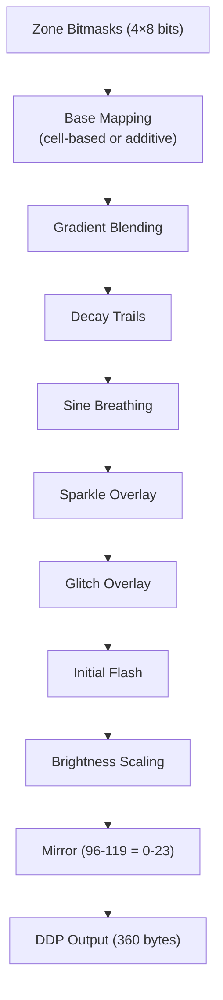
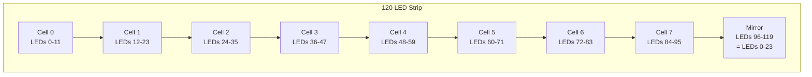

# Stage Kit → WLED Bridge

A Docker container that receives **YARG / RB3E** Stage Kit lighting data over UDP and outputs it as DDP pixel data to a **WLED** controller driving an APA102/SK9822 LED strip.

Translates all Stage Kit cues (Warm Auto, Cool Auto, Frenzy, Sweep, Big Rock Ending, etc.) into beat-synced color patterns across 120 LEDs with per-pixel effects, strobe overlay, and 12 color palettes. Includes a live web dashboard with built-in test pattern controls.

## Features

- **Full Stage Kit cue engine** — 21 cues with beat-synced patterns, event-triggered flares, and static presets
- **Per-pixel effects** — decay trails, sine breathing, sparkle overlay, gradient blending, glitch overlay, initial flash
- **12 color palettes** — Default RGBY, Party, Dancefloor, Plasma, Lava, Ocean, Forest, Sunset, Borealis, Frost, Sakura, Neon
- **DDP output** — sends raw RGB pixels directly to WLED (no segment config needed)
- **Dedicated render thread** — pixel rendering and DDP output run on an isolated OS thread with adaptive perf_counter timing, independent of the asyncio event loop
- **Interleaved zone layout** — 4 color zones spread across 8 cells of 12 LEDs each for smooth chase/sweep effects
- **Strobe overlay** — global brightness modulation at 2/4/8/16 Hz
- **Live web dashboard** — real-time zone visualization, event log, SSE streaming, palette preview
- **Built-in test controls** — trigger any of 21 cues from the web UI with adjustable BPM and strobe, no need to run YARG
- **Persistent settings** — brightness and palette stored in JSON, survive restarts
- **WLED power management** — auto-on when YARG starts, auto-off after idle timeout
- **Pure Python stdlib** — zero external dependencies, runs on Python 3.12+
- **Multi-arch Docker image** — builds for both `amd64` and `arm64`

## Quick Start

### Docker Compose (recommended)

```yaml
services:
  stagekit-bridge:
    image: ghcr.io/neopterygii/stagekit-wled-bridge:latest
    container_name: stagekit-wled-bridge
    restart: unless-stopped
    network_mode: host
    environment:
      WLED_HOST: "192.168.0.53"      # Your WLED controller IP
      LED_COUNT: "120"                # Number of LEDs on your strip
      GLOBAL_BRIGHTNESS: "255"        # 0-255
      IDLE_TIMEOUT: "1800"            # Auto-off after 30 min idle (0 = disabled)
```

```bash
docker compose up -d
```

The status page will be available at `http://<host>:8080/`.

### Run Locally

```bash
git clone https://github.com/neopterygii/stagekit-wled-bridge.git
cd stagekit-wled-bridge
WLED_HOST=192.168.0.53 python main.py
```

## Configuration

All settings are controlled via environment variables:

| Variable | Default | Description |
|---|---|---|
| `YARG_LISTEN_HOST` | `0.0.0.0` | Bind address for YARG UDP packets |
| `YARG_LISTEN_PORT` | `36107` | UDP port for YARG lighting data |
| `WLED_HOST` | `192.168.1.100` | IP address of your WLED controller |
| `WLED_DDP_PORT` | `4048` | DDP port on WLED (default is fine) |
| `LED_COUNT` | `120` | Total number of LEDs on the strip |
| `TARGET_FPS` | `40` | Render/DDP frame rate |
| `GLOBAL_BRIGHTNESS` | `255` | Master brightness (0–255) |
| `STATUS_HOST` | `0.0.0.0` | Bind address for the web status page |
| `STATUS_PORT` | `8080` | HTTP port for the status page |
| `IDLE_TIMEOUT` | `1800` | Seconds of no YARG packets before WLED is powered off (0 = disabled) |

### WLED Power Management

The bridge automatically manages your WLED controller's power state:

- **Auto-on**: WLED is turned on as soon as a YARG packet (or web UI test pattern) is received.
- **Auto-off**: After `IDLE_TIMEOUT` seconds with no activity, WLED is powered off via the JSON API.
- Set `IDLE_TIMEOUT=0` to disable automatic power management entirely.

## Architecture



### Render Pipeline



### LED Layout

The 120-LED strip uses a **cell-based** zone layout for smooth spatial effects:



Each zone bitmask bit controls one 12-LED cell. When multiple zones share a cell, the cell is subdivided (or additively blended, depending on the cue's effects config). Positions 96–119 mirror positions 0–23 for visual wrap-around.

## Status Page

The built-in web dashboard at port 8080 shows:

- **Connection status** — whether YARG packets are being received
- **Current cue** — active Stage Kit lighting cue name
- **BPM / Strobe / Packets/sec / DDP frames** — real-time metrics
- **WLED power** — on/off state with idle countdown timer and manual toggle
- **Brightness** — 5 step controls (10%, 25%, 50%, 75%, 100%)
- **Color palette** — dropdown to switch between 12 palettes with live preview swatches
- **Zone bitmask visualization** — 4×8 LED grid with colors matching the active palette
- **Event log** — scrolling log of cue changes, beats, and strobe events (capped at 200 entries)

### Test Controls

The dashboard includes a **Test Patterns** panel for triggering cues directly from the browser:

- Click any of the **21 cue buttons** to activate it with simulated beats and keyframes
- Adjust **BPM** with the slider (60–240)
- Toggle **strobe** at different speeds (Slow, Medium, Fast, Fastest)
- **Stop Test** button appears only when a test pattern is running
- WLED is automatically powered on when a test pattern is triggered

This is especially useful for verifying your WLED/LED setup without running YARG.

## YARG Setup

In YARG, enable the UDP data stream:

1. Open **Settings → All Settings → Experimental**
2. Enable **"UDP Data Stream"**

That's it — YARG will broadcast lighting data on UDP port 36107 to all devices on the local network.

> **Note:** The "Enable Stage Kit" and "Enable DMX" settings are for **USB Stage Kit hardware** and **sACN/DMX lighting** respectively. They are not needed for this bridge.

### Troubleshooting

If the status page shows "Disconnected" with 0 packets/sec:

| Check | Details |
|---|---|
| **YARG setting** | "UDP Data Stream" must be enabled in Settings → Experimental |
| **Firewall** | UDP port 36107 must not be blocked on the host running the container |
| **Network mode** | The container must use `network_mode: host` to receive UDP broadcasts |
| **Same subnet** | YARG PC and the container host must be on the same network/VLAN |
| **Play a song** | Full lighting data (BPM, beats, cues) requires an active song — though YARG does send basic data from the menu screen |
| **Test the strip first** | Use the built-in Test Patterns on the status page to verify WLED/LED connectivity independently of YARG |

## WLED Setup

See [WLED_SETUP.md](WLED_SETUP.md) for detailed WLED configuration instructions.

**Key requirements:**
- LED type: SK9822 (APA102-compatible) with Data + Clock pins
- LED count: match your `LED_COUNT` setting
- "Receive UDP realtime" must be checked (enables DDP automatically in WLED 0.14.x)

## Supported Cues

| Cue | Effect | Description |
|---|---|---|
| Default | Trails | Blue/Red alternating on keyframe events |
| Verse | Breathing, Trails | Ambient blue wash with slow sine breathing |
| Chorus | Trails, Sparkle | Red chase + solid yellow base, sparkle on downbeats |
| Intro | Breathing | Green ambient breathing |
| Warm Automatic | Trails | Red opposing chase + Yellow CCW scanner |
| Warm Manual | Trails | Same as Warm Auto (manual beat control) |
| Cool Automatic | Trails | Blue opposing chase + Green CCW scanner |
| Cool Manual | Trails | Same as Cool Auto (manual beat control) |
| Big Rock Ending | Trails, Sparkle | 4-color rotating chase with beat sparkles |
| Frenzy | Trails, Sparkle | Fast 3-color chase with direction reversals |
| Searchlights | Trails, Additive | Yellow CW + Blue CCW single-bit comet beams |
| Sweep | Trails | Smooth red bidirectional sweep |
| Harmony | Trails, Additive | Yellow + Red counter-rotation with color mixing |
| Dischord | Trails, Glitch | Counter-rotating chases + random color inversions |
| Stomp | Trails, Sparkle | Keyframe-triggered 3-zone chase |
| Flare Slow | Additive, Breathing, Flash | White flash → all-zone gentle breathing pulse |
| Flare Fast | Additive, Breathing, Flash | Quick white flash → blue breathing |
| Silhouettes | Breathing | Slow ambient green breathing |
| Silhouettes Spotlight | Breathing | Slightly faster green breathing |
| Menu | Trails | Blue scanner with long comet trail |
| Score | Trails, Sparkle | Timed dual chase with continuous confetti |
| Blackout | — | All LEDs off |

## Development

### Test Packet Sender

A standalone test sender is included for development without YARG:

```bash
# Cycle through all cues
python test_sender.py --pattern cycle_cues

# Specific pattern at custom BPM
python test_sender.py --pattern warm_loop --bpm 140

# Available patterns: all_on, warm_loop, cool_loop, sweep,
#                     big_rock_ending, strobe_fast, cycle_cues
```

### Build Docker Image Locally

```bash
docker build -t stagekit-wled-bridge .
docker run --network host -e WLED_HOST=192.168.0.53 stagekit-wled-bridge
```

### Project Structure

```
├── main.py                  # Entry point — render thread + asyncio event loop
├── config.py                # Environment variable configuration
├── settings.py              # Persistent settings (brightness, palette)
├── status_server.py         # Web dashboard + SSE + test controls
├── test_sender.py           # Standalone fake YARG packet generator
├── protocol/
│   ├── yarg_packet.py       # YARG UDP packet parser & enums
│   ├── ddp_sender.py        # DDP protocol sender
│   └── wled_api.py          # WLED JSON API (power control)
├── effects/
│   ├── cue_engine.py        # Stage Kit cue state machine
│   └── mapper.py            # Zone bitmasks → RGB pixel data + effects
├── Dockerfile
├── docker-compose.yml
└── .github/workflows/
    └── docker.yml           # CI: build & push to ghcr.io
```

## Hardware

Built for and tested with:
- **LEDs:** BTF-LIGHTING SK9822 (APA102-compatible), 60 LEDs/m, 2× 1m strips daisy-chained (120 total)
- **Housing:** 1m aluminum channels with frosted diffusers
- **Controller:** ESP32 running WLED 0.14.4 "Hoshi"
- **Protocol:** DDP over WiFi (UDP port 4048)

## Acknowledgments

- **YARG icon** from [YARC-Official/OpenSource](https://github.com/YARC-Official/OpenSource) — public domain ([Unlicense](https://github.com/YARC-Official/OpenSource/blob/master/LICENSE))
- **YARG** (Yet Another Rhythm Game) — [yarg.in](https://yarg.in/)

## License

MIT
