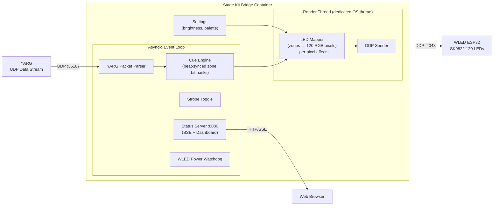
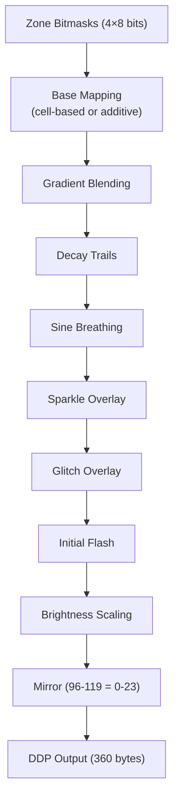
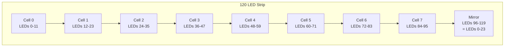

# Stage Kit → WLED Bridge

A Docker container that receives **YARG / RB3E** Stage Kit lighting data over UDP and outputs it as DDP pixel data to a **WLED** controller driving an APA102/SK9822 LED strip.

Translates all Stage Kit cues (Warm Auto, Cool Auto, Frenzy, Sweep, Big Rock Ending, etc.) into beat-synced color patterns across 120 LEDs with per-pixel effects, tempo-locked strobe, and 12 color palettes. Every field YARG puts on the wire — notes, vocals, performers, camera cuts, star power, post-processing, fog, venue size, song section — drives the light or the dashboard. Includes a live web dashboard with built-in test pattern controls.

## Features

- **Full Stage Kit cue engine** — all 33 YARG `CueByte` values: 25 lighting cues with beat-synced patterns, event-triggered flares and static presets, plus 5 strobe speeds and 3 keyframe steps
- **Per-pixel effects** — decay trails, sine breathing, sparkle overlay, gradient blending, glitch overlay, initial flash
- **Layer/slot compositor** — wash, motion, sparkle, flash, bonus, note, and vocal layers composed in a fixed order rather than overwritten in place
- **12 color palettes** — Default RGBY, Party, Dancefloor, Plasma, Lava, Ocean, Forest, Sunset, Borealis, Frost, Sakura, Neon
- **Palette strictness** — the reactivity layers (vocal ribbon, performer/camera/section biases, cue gradients, star-power tint) each paint from a fixed colour table of their own, which looks right under Default and foreign under everything else. Strictness constrains them to the selected palette's family, drawn where possible from the full upstream LedFx/WLED gradient rather than the four colours the Stage Kit's zone model can carry. On by default; slide to 0% for the original fixed colours
- **Beat oscillator** — continuous beat clock that coasts through dropped beat pulses, phase-locked chase motion (PLL with free-run fallback), and beat-locked gradient scroll
- **Instrument and vocal reactivity** — per-instrument note-hold accents in each instrument's slice of the strip, and a colour-by-pitch vocal ribbon for lead plus three harmonies
- **Performer and camera awareness** — spotlight/singalong bias toward the featured players, and camera-cut subject region/hue bias with a directed-cut accent
- **Star power** — charging tint that builds with the meter, then a surge-and-shimmer overlay while overdrive is active
- **Venue and section awareness** — tempo-locked strobe (BPM × note division), venue-size pattern density, and song-section palette/energy bias
- **Post-processing and fog** — venue colour grades applied as a global palette modifier, plus a blur/mirror chain that lifts toward a blur-glow floor while the haze is up
- **DDP output** — sends raw RGB pixels directly to WLED (no segment config needed)
- **Dedicated render thread** — pixel rendering and DDP output run on an isolated OS thread with adaptive perf_counter timing, independent of the asyncio event loop
- **Interleaved zone layout** — 4 color zones spread across 8 cells of 12 LEDs each for smooth chase/sweep effects
- **Live web dashboard** — live strip and per-layer preview, beat clock, zone visualization, event log, SSE streaming, palette preview
- **Built-in test controls** — trigger any of 21 cues from the web UI with adjustable BPM and strobe, no need to run YARG
- **Persistent settings** — brightness, palette, FPS, direction, blur/venue/section intensities, palette strictness and per-effect toggles stored in JSON, survive restarts
- **WLED power management** — auto-on when YARG starts, auto-off after idle timeout
- **Pure Python stdlib** — zero external dependencies, runs on Python 3.12+
- **Multi-arch Docker image** — builds for both `amd64` and `arm64`, gated on the test suite in CI

## Quick Start

### Docker Compose (recommended)

```yaml
services:
  stagekit-bridge:
    image: ghcr.io/neopterygii/stagekit-wled-bridge:latest
    container_name: stagekit-wled-bridge
    restart: unless-stopped
    network_mode: host
    environment:
      WLED_HOST: "192.168.0.53"      # Your WLED controller IP
      LED_COUNT: "120"                # Number of LEDs on your strip
      GLOBAL_BRIGHTNESS: "255"        # 0-255
      IDLE_TIMEOUT: "1800"            # Auto-off after 30 min idle (0 = disabled)
    volumes:
      - stagekit-data:/data           # Persists brightness/palette/fps across container recreates

volumes:
  stagekit-data:
```

> **Note on the web UI:** the dashboard binds to `0.0.0.0:8080` with no
> authentication. Anyone on your LAN can change brightness, palette, FPS,
> trigger test patterns, and toggle WLED power. Fine for a home network;
> don't expose port 8080 to the public internet.

```bash
docker compose up -d
```

The status page will be available at `http://<host>:8080/`.

### Run Locally

```bash
git clone https://github.com/neopterygii/stagekit-wled-bridge.git
cd stagekit-wled-bridge
WLED_HOST=192.168.0.53 python main.py
```

## Configuration

All settings are controlled via environment variables:

| Variable | Default | Description |
|---|---|---|
| `YARG_LISTEN_HOST` | `0.0.0.0` | Bind address for YARG UDP packets |
| `YARG_LISTEN_PORT` | `36107` | UDP port for YARG lighting data |
| `WLED_HOST` | `192.168.1.100` | IP address of your WLED controller |
| `WLED_DDP_PORT` | `4048` | DDP port on WLED (default is fine) |
| `LED_COUNT` | `120` | Total number of LEDs on the strip |
| `TARGET_FPS` | `40` | Render/DDP frame rate |
| `GLOBAL_BRIGHTNESS` | `255` | Master brightness (0–255) |
| `STATUS_HOST` | `0.0.0.0` | Bind address for the web status page |
| `STATUS_PORT` | `8080` | HTTP port for the status page |
| `IDLE_TIMEOUT` | `1800` | Seconds of no YARG packets before WLED is powered off (0 = disabled) |
| `LOG_LEVEL` | `INFO` | `DEBUG`, `INFO`, `WARNING`, or `ERROR` |
| `SETTINGS_FILE` | `/data/settings.json` | Where to store runtime settings (brightness, palette, FPS, direction) |

### Persistent Settings

Brightness, palette, FPS, direction and the idle look are stored in `SETTINGS_FILE`
(`/data/settings.json` by default) so they survive container restarts.
The compose example above mounts a named volume at `/data` for this. If
`/data` isn't writable the bridge logs a warning and runs read-only —
runtime changes will work but won't survive a recreate.

### Strip Ownership

The bridge treats every strip it drives as **owned**: while it is running, there
is no moment when the strip's appearance is undefined. Three modes cover the
whole lifetime, and the dashboard names which one you are in.

| Mode | The strip is | Entered when |
|---|---|---|
| **Live** | showing the bridge's DDP frames | a YARG packet or a web UI test pattern arrives |
| **Idle** | powered, running a look WLED renders itself | no activity for the grace period (default 15 s) |
| **Off** | powered down | no activity for `IDLE_TIMEOUT` |

**The device baseline.** Before frames start flowing — at startup, at each
power-on, and when adopting a strip powered up outside the bridge — the bridge
asserts a known state: master brightness 255, `transition: 0`, nightlight off,
live-override cleared, sync-receive off, and segment 0 spanning the strip with a
black solid as its fallback effect.

Master brightness matters more than it looks. WLED multiplies incoming realtime
pixels by it unless `if.live.maxbri` is set, so a device left at the factory
default of 128 silently halves everything the bridge sends. The bridge already
bakes its own brightness setting into every pixel, so the baseline makes that
the **only** dimmer. If the strip looks brighter than it used to after upgrading,
this is why — re-tune the dashboard brightness slider, not the device.

Enforcement is on **transitions only**, so the WLED app stays usable between
songs; a mode change is what stomps whatever it did.

**The idle look** is what the strip shows when the bridge is not sending. WLED
renders it standalone, so "no DDP" has a defined appearance instead of leaving
the last cue frozen on the strip for half an hour. Configure it in the
dashboard's **Idle Look** panel — mode, effect, palette, colour, brightness,
speed, intensity, and the grace period. The effect and palette lists come from
your device (`GET /api/wled`), not from a table baked into the bridge.

Three idle modes: `preset` (WLED renders the chosen effect), `black` (powered
and owned, showing nothing), and `off` (skip the idle stage and power down at
the grace period).

Note the idle look appears a couple of seconds *after* the last frame: WLED
holds the final DDP frame until its own realtime timeout lapses (`if.live.timeout`,
2.5 s by default).

**Adoption.** A strip powered on by anything else — a reboot, the WLED app, a
button press — is claimed by the bridge on its next 30 s probe and given the
idle look, then granted a full idle timeout. That is what ownership means here,
and it is the one place the bridge overrides an action taken elsewhere.

- Set `IDLE_TIMEOUT=0` to stop the strip ever powering off. It is still owned,
  and still falls back to its idle look.

## Architecture


```mermaid
graph LR
    YARG["YARG<br/>UDP Data Stream"] -->|UDP :36107| Parser["YARG Packet Parser"]

    subgraph Container["Stage Kit Bridge Container"]
        direction TB
        Parser --> Engine["Cue Engine<br/>(beat-synced zone bitmasks)"]

        subgraph AsyncLoop["Asyncio Event Loop"]
            Parser
            Engine
            Strobe["Strobe Toggle"]
            Status["Status Server :8080<br/>(SSE + Dashboard)"]
            Watchdog["WLED Power Watchdog"]
        end

        subgraph RenderThread["Render Thread (dedicated OS thread)"]
            Mapper["LED Mapper<br/>(zones → 120 RGB pixels)<br/>+ per-pixel effects"]
            DDP["DDP Sender"]
        end

        Engine --> Mapper
        Settings["Settings<br/>(brightness, palette)"] --> Mapper
        Mapper --> DDP
    end

    DDP -->|DDP :4048| WLED["WLED ESP32<br/>SK9822 120 LEDs"]
    Status -->|HTTP/SSE| Browser["Web Browser"]
```

### Render Pipeline


```mermaid
graph TD
    A["Zone Bitmasks (4×8 bits)"] --> B["Base Mapping<br/>(cell-based or additive)"]
    B --> C["Gradient Blending"]
    C --> D["Decay Trails"]
    D --> E["Sine Breathing"]
    E --> F["Sparkle Overlay"]
    F --> G["Glitch Overlay"]
    G --> H["Initial Flash"]
    H --> I["Brightness Scaling"]
    I --> J["Mirror (96-119 = 0-23)"]
    J --> K["DDP Output (360 bytes)"]
```

### LED Layout

The 120-LED strip uses a **cell-based** zone layout for smooth spatial effects:


```mermaid
graph LR
    subgraph Strip["120 LED Strip"]
        direction LR
        C0["Cell 0<br/>LEDs 0-11"] --> C1["Cell 1<br/>LEDs 12-23"] --> C2["Cell 2<br/>LEDs 24-35"] --> C3["Cell 3<br/>LEDs 36-47"]
        C3 --> C4["Cell 4<br/>LEDs 48-59"] --> C5["Cell 5<br/>LEDs 60-71"] --> C6["Cell 6<br/>LEDs 72-83"] --> C7["Cell 7<br/>LEDs 84-95"]
        C7 --> Mirror["Mirror<br/>LEDs 96-119<br/>= LEDs 0-23"]
    end
```

Each zone bitmask bit controls one 12-LED cell. When multiple zones share a cell, the cell is subdivided (or additively blended, depending on the cue's effects config). Positions 96–119 mirror positions 0–23 for visual wrap-around.

## Status Page

The built-in web dashboard at port 8080 shows:

- **Connection status** — whether YARG packets are being received
- **Current cue** — active Stage Kit lighting cue name
- **BPM / Strobe / Packets/sec / DDP frames** — real-time metrics
- **WLED power** — Live / Idle / Off mode with idle countdown timer and manual toggle
- **Brightness** — 5 step controls (10%, 25%, 50%, 75%, 100%)
- **Color palette** — dropdown to switch between 12 palettes with live preview swatches
- **Palette strictness** — slider for how tightly the reactivity layers follow the selected palette (0% = their original fixed colours)
- **Live strip preview** — what the strip is actually showing. While the bridge
  is not driving the strip the canvases go black and a caption names why; they
  are a picture of the strip, not of the bridge's render buffer
- **Idle look** — the effect, palette, colour and grace period for what the
  strip shows between songs
- **Zone bitmask visualization** — 4×8 LED grid with colors matching the active palette
- **Event log** — scrolling log of cue changes, beats, and strobe events (capped at 200 entries)
- **Build identity** — a quiet line beside the title naming the version and the
  commit the image was built from; hover for the build time and source. See
  [Versioning](#versioning)

### Test Controls

The dashboard includes a **Test Patterns** panel for triggering cues directly from the browser:

- Click any of the **21 cue buttons** to activate it with simulated beats and keyframes
- Adjust **BPM** with the slider (60–240)
- Toggle **strobe** at different speeds (Slow, Medium, Fast, Fastest)
- **Stop Test** button appears only when a test pattern is running
- WLED is automatically powered on when a test pattern is triggered

This is especially useful for verifying your WLED/LED setup without running YARG.

## YARG Setup

In YARG, enable the UDP data stream:

1. Open **Settings → All Settings → Experimental**
2. Enable **"UDP Data Stream"**

That's it — YARG will broadcast lighting data on UDP port 36107 to all devices on the local network.

> **Note:** The "Enable Stage Kit" and "Enable DMX" settings are for **USB Stage Kit hardware** and **sACN/DMX lighting** respectively. They are not needed for this bridge.

### Troubleshooting

If the status page shows "Disconnected" with 0 packets/sec:

| Check | Details |
|---|---|
| **YARG setting** | "UDP Data Stream" must be enabled in Settings → Experimental |
| **Firewall** | UDP port 36107 must not be blocked on the host running the container |
| **Network mode** | The container must use `network_mode: host` to receive UDP broadcasts |
| **Same L2 broadcast domain** | YARG sends to `255.255.255.255` (limited broadcast). It does not cross VLANs or routed subnets — the YARG PC and the container host must share the same L2 segment |
| **Wi-Fi → wired bridging** | Some Wi-Fi APs drop or refuse to forward limited broadcasts onto the wired LAN. "Client isolation" / "AP isolation" / guest-network features will silently break this. Try moving the YARG PC onto the same network type as the host, or test from a wired client |
| **Multi-homed sender** | macOS / Windows hosts with both Wi-Fi and Ethernet active will pick one outgoing interface for the broadcast. If it picks the "wrong" one, the broadcast may not reach the bridge — disable the other interface to test |
| **Play a song** | Full lighting data (BPM, beats, cues) requires an active song — though YARG does send basic data from the menu screen |
| **Test the strip first** | Use the built-in Test Patterns on the status page to verify WLED/LED connectivity independently of YARG |

**Diagnose where it's broken with one command** (run on the host running the container):

```bash
# In the container:
docker exec stagekit-wled-bridge sh -c \
  "apk add --no-cache tcpdump >/dev/null && tcpdump -ni any -c 5 udp dst port 36107"
```

- **Zero packets** → YARG packets aren't reaching this host. Sender / network / firewall problem.
- **Packets visible but `/api/status` shows `packets_received: 0`** → bridge / parser problem (open an issue).

## WLED Setup

See [WLED_SETUP.md](WLED_SETUP.md) for detailed WLED configuration instructions.

**Key requirements:**
- LED type: SK9822 (APA102-compatible) with Data + Clock pins
- LED count: match your `LED_COUNT` setting
- "Receive UDP realtime" must be checked (enables DDP automatically in WLED 0.14.x)

## Supported Cues

| Cue | Effect | Description |
|---|---|---|
| Default | Trails | Blue/Red alternating on keyframe events |
| Verse | Breathing, Trails | Ambient blue wash with slow sine breathing |
| Chorus | Trails, Sparkle | Red chase + solid yellow base, sparkle on downbeats |
| Intro | Breathing | Green ambient breathing |
| Warm Automatic | Trails | Red opposing chase + Yellow CCW scanner |
| Warm Manual | Trails | Same as Warm Auto (manual beat control) |
| Cool Automatic | Trails | Blue opposing chase + Green CCW scanner |
| Cool Manual | Trails | Same as Cool Auto (manual beat control) |
| Big Rock Ending | Trails, Sparkle | 4-color rotating chase with beat sparkles |
| Frenzy | Trails, Sparkle | Fast 3-color chase with direction reversals |
| Searchlights | Trails, Additive | Yellow CW + Blue CCW single-bit comet beams |
| Sweep | Trails | Smooth red bidirectional sweep |
| Harmony | Trails, Additive | Yellow + Red counter-rotation with color mixing |
| Dischord | Trails, Glitch | Counter-rotating chases + random color inversions |
| Stomp | Trails, Sparkle | Keyframe-triggered 3-zone chase |
| Flare Slow | Additive, Breathing, Flash | White flash → all-zone gentle breathing pulse |
| Flare Fast | Additive, Breathing, Flash | Quick white flash → blue breathing |
| Silhouettes | Breathing | Slow ambient green breathing |
| Silhouettes Spotlight | Breathing | Slightly faster green breathing |
| Menu | Trails | Blue scanner with long comet trail |
| Score | Trails, Sparkle | Timed dual chase with continuous confetti |
| Blackout | — | All LEDs off |

## Versioning

The bridge reports which image it is running, so a deploy can be confirmed
rather than assumed. It appears in three places:

- the dashboard, beside the title (hover for commit, build time and source);
- `GET /api/status` under `version`, for scripting;
- the startup banner — `docker logs` is the only one of the three that works
  when the status port is unreachable, which is usually when it matters.

```bash
curl -s http://<host>:<STATUS_PORT>/api/status | jq .version
docker logs stagekit-wled-bridge 2>&1 | head -1
```

`commit` and `built` are injected at **image build time** by CI, so they
identify the image rather than the source tree — that distinction is the whole
point when a deploy looks like it did not take. `source` is `image` for a CI
build and `checkout` when running from source, where `git describe` fills in
instead; a `checkout` build renders in yellow on the dashboard, because it is
never what the rig should be on.

`version` comes from `__version__` in `version.py`, except on a `v*` tag build,
where the tag wins. **Bump `__version__` and tag the release commit to match** —
a forgotten bump shows up as a mismatch between the reported version and the
commit rather than shipping silently.

## Development

### Tests

The suite is stdlib-only apart from pytest, and needs no WLED controller, no
YARG, and no network:

```bash
pip install -r requirements-dev.txt
python -m pytest tests/ -q
```

CI runs the same command and the container image is only built if it passes.

### Capture and Replay

The bridge can record the YARG datagrams it receives and play them back through
the real pipeline, so a lighting change can be judged against the same
performance twice instead of from memory of last night's show.

Record from a running bridge (writes to `/data/captures/`):

```bash
curl -X POST http://<host>:8080/api/capture -d '{"action":"start","note":"song name"}'
curl -X POST http://<host>:8080/api/capture -d '{"action":"stop"}'
curl http://<host>:8080/api/capture          # state + recent captures
```

Recording auto-stops at a size/packet cap, so a forgotten capture can't fill the
volume. Captures are JSONL — one datagram per line, base64 — holding **protocol
data only**: no audio, no chart content.

Replay it two ways:

```bash
# In process, deterministic, no hardware — what the tests use
python -m replay.player capture.jsonl --fps 40

# Over UDP at original timing, to a running bridge and a real strip
python -m replay.cli capture.jsonl --host 192.168.0.230 --speed 1 --loop

# Watch DDP output without a WLED controller attached
python -m replay.ddp_receiver --port 4048
```

Replay is deterministic because the cue engine, mapper and render loop all take
an injected clock, and the mapper's sparkle/glitch RNG takes a seed. One known
gap: the keyframe- and beat-*event*-driven cues (`DEFAULT`, `WARM_MANUAL`,
`COOL_MANUAL`, `STOMP`, `DISCHORD`) still step on asyncio events, so their motion
doesn't advance under replay — see `BACKLOG.md`.

### Test Packet Sender

A standalone test sender is included for development without YARG:

```bash
# Cycle through all cues
python test_sender.py --pattern cycle_cues

# Specific pattern at custom BPM
python test_sender.py --pattern warm_loop --bpm 140

# Available patterns: all_on, warm_loop, cool_loop, sweep, big_rock_ending,
#                     strobe_fast, cycle_cues, star_power, camera_cuts
```

### Build Docker Image Locally

```bash
docker build -t stagekit-wled-bridge .
docker run --network host -e WLED_HOST=192.168.0.53 stagekit-wled-bridge
```

A locally built image carries no build args, so it reports itself as an unknown
build. Pass them to match what CI produces:

```bash
docker build -t stagekit-wled-bridge \
  --build-arg BUILD_SHA="$(git rev-parse HEAD)" \
  --build-arg BUILD_TIME="$(date -u +'%Y-%m-%d %H:%M UTC')" .
```

### Project Structure

```
├── main.py                  # Entry point — render thread + asyncio event loop
├── config.py                # Environment variable configuration
├── settings.py              # Persistent settings (brightness, palette)
├── version.py               # Build identity (CI-injected commit + build time)
├── status_server.py         # Web dashboard + SSE + test controls
├── test_sender.py           # Standalone fake YARG packet generator
├── protocol/
│   ├── yarg_packet.py       # YARG UDP packet parser & enums
│   ├── ddp_sender.py        # DDP protocol sender
│   └── wled_api.py          # WLED JSON API (power control)
├── effects/
│   ├── cue_engine.py        # Stage Kit cue state machine
│   ├── compositor.py        # Ordered layer/slot composition
│   ├── gradient.py          # Eased gradient palettes, beat-locked scroll
│   └── mapper.py            # Zone bitmasks → RGB pixel data + effects
├── replay/                  # Datagram capture + replay harness
│   ├── capture.py           # JSONL capture format + hot-path recorder
│   ├── controller.py        # Runtime start/stop, buffer flush, size caps
│   ├── player.py            # Deterministic in-process replay (synthetic clock)
│   ├── cli.py               # Wall-clock UDP replay to a live bridge
│   └── ddp_receiver.py      # Headless DDP sink (stands in for WLED)
├── venue_scan/              # Offline library inventory (not part of the runtime)
│   ├── scan.py              # Indexer entry point
│   ├── discover.py          # Song/package discovery
│   ├── containers/          # SNG, RB3CON/STFS, songs.dta readers
│   ├── venue_midi.py        # MIDI VENUE track decoding (text + legacy notes)
│   ├── venue_milo.py        # .milo/.milo_xbox animation venue data
│   └── classify.py          # Lighting-source classification per YARG's gates
├── tests/                   # pytest suite (stdlib only, no live hosts needed)
├── Dockerfile
├── docker-compose.yml
└── .github/workflows/
    └── docker.yml           # CI: pytest, then build & push to ghcr.io
```

`venue_scan/` is analysis tooling, not part of the bridge runtime — it reads the
song library to answer which lighting sources and cues actually occur, so effect
work can be aimed at what real charts contain. See `VISION.md`.

## Hardware

Built for and tested with:
- **LEDs:** BTF-LIGHTING SK9822 (APA102-compatible), 60 LEDs/m, 2× 1m strips daisy-chained (120 total)
- **Housing:** 1m aluminum channels with frosted diffusers
- **Controller:** ESP32 running WLED 0.14.4 "Hoshi"
- **Protocol:** DDP over WiFi (UDP port 4048)

## Acknowledgments

- **YARG icon** from [YARC-Official/OpenSource](https://github.com/YARC-Official/OpenSource) — public domain ([Unlicense](https://github.com/YARC-Official/OpenSource/blob/master/LICENSE))
- **YARG** (Yet Another Rhythm Game) — [yarg.in](https://yarg.in/)

## License

MIT
